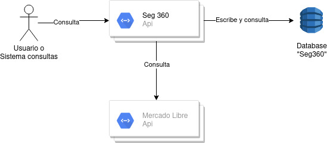

# Seg360

Este proyecto está implementado con Java, utilizando Micronaut framework.

## ¿Cómo ejecutar la aplicación?

### Variables de entorno

Se consideran las siguientes variables de entorno, las cuales pueden ser modificadas en el equipo en donde se ejecuta. Tener en cuenta que estos son los valores por defecto dadas a cada una.

```yaml
    API_ITEMS_URL: https://api.mercadolibre.com/
    SEG360_JDBC_URL: jdbc:postgresql://127.0.0.1:5432/seg360
    SEG360_JDBC_USER: seg360
    SEG360_JDBC_PASSWORD: Sec*969676
```

- La base de datos seg360 debe estar creada.
- Los datos de acceso a la base de datos deben ser verificados antes de ejecutar la aplicación. 
- Las tablas serán creadas automáticamente al ejecutar la aplicación por primera vez.

### Ejecución
Una vez configurado, se puede ejecutar con maven:

    mvn clean compile install exec:exec


## ¿Cómo ejecutar por medio de docker?

Se deben seguir los siguientes pasos para ejecutar la aplicación como docker:

1. Crear las variables de entorno con los valores correctos.
2. Compilar la aplicación: mvn clean compile install
3. Crear el docker: sh docker-build.sh
4. Ejecutar la aplicación: docker run --net=host --rm -p 8080:8080 seg360

Nota: Se incluye el parámetro --net=host para acceder a la base de datos de la máquina local por medio de la ip 127.0.0.1 


## Funcionamiento Interno de la Aplicación

La aplicación realiza consultas al API de mercado libre. Una vez consultada la información, esta es almacenada en la base de datos local de modo que las siguientes veces que se consulte el mismo ITEM se entregue la información local en lugar de buscarla nuevamente en el API.




## Mejoras propuestas

Estas son algunas mejoras que podría tener la arquitectura implementada:

1. Validaciones de tokens de seguridad en la ejecución de los endpoints.
2. Utilizar una base de datos distribuida y de alta disponibilidad para almacenar la información consultada.
3. Utilizar una memoria intermedia, como memcached o redis, para mantener disponible la información consultada más frecuentemente, como los datos devueltos por el healthcheck.
4. Desplegar la aplicación en un entorno de alta disponibilidad, distribuido en diferentes zonas y regiones, y con un checkeo constante del estado de la app para redirigir el tráfico a una instancia disponible en caso de errores.
5. Manejar un tiempo de caducidad del registro importado, ya que una vez consultado un registro a través de la API de mercado libre, esta nunca más se vuelve a consultar, pero esa información puede quedar desactualizada si no se consulta nuevamente después de cierto tiempo.